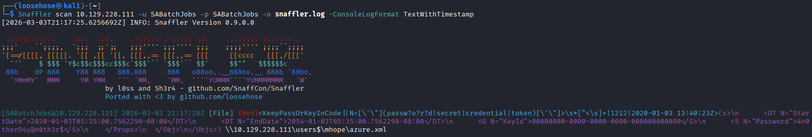

# Titanis (Fork)

Fork of [TrustedSec's Titanis](https://github.com/trustedsec/Titanis) with the following additions:

**Titanis.Net.Ldap** -- LDAP client library ([RFC 4511](https://datatracker.ietf.org/doc/html/rfc4511)) with SP-NEGO authentication, search filters, and an Active Directory convenience layer. Integrates with the existing Kerberos/NTLM auth stack.

**Snaffler** -- Cross-platform credential hunting tool. Walks SMB shares, classifies files using TOML rule sets, and reports credential material. A from-scratch reimplementation on top of Titanis's SMB2 client (not a port of the original C# Snaffler).

Also includes 12 bug fixes found during live AD testing (Kerberos inter-realm, KRB-ERROR handling, NTLM/S4U interactions, socket services, and build/visibility fixes).

## Quick Start

```
git clone https://github.com/loosehose/Titanis.git
cd Titanis
dotnet build
```

See [BUILD.md](BUILD.md) for prerequisites and platform-specific instructions.

## Snaffler



Each tool builds as a standalone binary:

```
# Scan shares for credentials
Snaffler scan dc01.corp.local -u admin -p 'Password123!'

# Discover targets via LDAP and scan
Snaffler scan -d dc01.corp.local -u admin -ud CORP -p 'Password123!'

# List shares on a target
Snaffler shares dc01.corp.local -u admin -ud CORP -p 'Password123!'

# List loaded classification rules
Snaffler rules
```

For the full command reference, see the [Snaffler Usage Guide](doc/UserGuide/tools/Snaffler-Usage.md).

## Upstream

This fork tracks the `public` branch of [trustedsec/Titanis](https://github.com/trustedsec/Titanis). All original functionality is preserved.

---

# Introduction
Titanis is a library of protocol implementations and command line utilities, written in C#, for interacting with Windows environments.  It uses .NET 8 and is cross-platform (Windows and Linux).  Some of the protocols implemented:

* SMB2 ([MS-SMB2](https://winprotocoldocs-bhdugrdyduf5h2e4.b02.azurefd.net/MS-SMB2/%5bMS-SMB2%5d.pdf))
	* SMB 2.x and 3.x up to 3.1.1
	* Message security features such as signing and encryption
	* Includes support for filesystem control codes ([MS-FSCC](https://winprotocoldocs-bhdugrdyduf5h2e4.b02.azurefd.net/MS-FSCC/%5bMS-FSCC%5d.pdf))
	* DFS links ([MS-DFSC](https://winprotocoldocs-bhdugrdyduf5h2e4.b02.azurefd.net/MS-DFSC/%5bMS-DFSC%5d.pdf))
* MSRPC ([MS-RPCE](https://winprotocoldocs-bhdugrdyduf5h2e4.b02.azurefd.net/MS-RPCE/%5bMS-RPCE%5d.pdf))
	* Endpoint mapper
	* DCOM ([MS-DCOM](https://winprotocoldocs-bhdugrdyduf5h2e4.b02.azurefd.net/MS-DCOM/%5bMS-DCOM%5d.pdf))
	* EFS ([MS-EFSR](https://winprotocoldocs-bhdugrdyduf5h2e4.b02.azurefd.net/MS-EFSR/%5bMS-EFSR%5d.pdf))
	* LSA ([MS-LSAD](https://winprotocoldocs-bhdugrdyduf5h2e4.b02.azurefd.net/MS-LSAD/%5bMS-LSAD%5d.pdf) and [MS-LSAT](https://winprotocoldocs-bhdugrdyduf5h2e4.b02.azurefd.net/MS-LSAT/%5bMS-LSAT%5d.pdf))
	* Security Accounts Manager ([MS-SAMR](https://winprotocoldocs-bhdugrdyduf5h2e4.b02.azurefd.net/MS-SAMR/%5bMS-SAMR%5d.pdf))
	* Service Control Manager ([MS-SCMR](https://winprotocoldocs-bhdugrdyduf5h2e4.b02.azurefd.net/MS-SCMR/%5bMS-SCMR%5d.pdf))
	* Server service ([MS-SRVS](https://winprotocoldocs-bhdugrdyduf5h2e4.b02.azurefd.net/MS-SRVS/%5bMS-SRVS%5d.pdf))
	* WMI ([MS-WMI](https://winprotocoldocs-bhdugrdyduf5h2e4.b02.azurefd.net/MS-WMI/%5bMS-WMI%5d.pdf) and [MS-WMIO](https://winprotocoldocs-bhdugrdyduf5h2e4.b02.azurefd.net/MS-WMIO/%5bMS-WMIO%5d.pdf))
* Security
	* NTLM ([MS-NLMP](https://winprotocoldocs-bhdugrdyduf5h2e4.b02.azurefd.net/MS-NLMP/%5bMS-NLMP%5d.pdf))
	* Kerberos ([RFC4120](https://datatracker.ietf.org/doc/html/rfc4120) and [MS-KILE](https://winprotocoldocs-bhdugrdyduf5h2e4.b02.azurefd.net/MS-KILE/%5bMS-KILE%5d.pdf))
		* Inter-realm referrals
		* S4U ([MS-SFU](https://winprotocoldocs-bhdugrdyduf5h2e4.b02.azurefd.net/MS-WMI/%5bMS-WMI%5d.pdf))
			* S4U2self
			* S4U2proxy
		* Encryption profiles
			* DES CBC MD5 ([RFC3961](https://datatracker.ietf.org/doc/html/rfc3961)) (AS only)
			* RC4-HMAC ([RFC4757](https://datatracker.ietf.org/doc/html/rfc4757))
			* AES 128/256 ([RFC3962](https://datatracker.ietf.org/doc/html/rfc3962))
			* Support for .kirbi and [ccache](https://web.mit.edu/kerberos/krb5-1.21/doc/formats/ccache_file_format.html) files
			* Support for [keytab](https://web.mit.edu/kerberos/krb5-devel/doc/formats/keytab_file_format.html) files
		* Change / set password ([RFC3244](https://datatracker.ietf.org/doc/html/rfc3244))
	* SP-NEGO ([MS-SPNG](https://winprotocoldocs-bhdugrdyduf5h2e4.b02.azurefd.net/MS-SPNG/%5bMS-SPNG%5d.pdf))
* Integrated SOCKS 5 support (`-Socks5` parameter) ([RFC1928](https://datatracker.ietf.org/doc/html/rfc1928))


For recent changes, see the [change log](CHANGELOG.md)

For an overview on supported authentication scenarios, see [Authentication](syntax-auth.md) - Describes how to control authentication with parameters


The toolset implements callbacks and logging features to integrate into your operational environment.

For a list of command line tools and tasks you can perform with them, check the [Tool Index](doc/UserGuide/tools/index.md)

# Target Audience
*  **Security researchers** - Research how Windows reacts to various types of requests
*  **Pentesters** - Perform actions and test whether mitigations are enabled and functioning properly
*  **System administrators** - Perform administrative tasks

# Getting Started

[Build Instructions](BUILD.md)

If you are a user, see the [User Guide](doc/UserGuide/index.md) for a list of command line utilities and how to use them.

If you are a developer, see the [Developer Guide](doc/DevGuide/index.md) for information on how to enhance the code base.

# Planned Enhancements
* Task Scheduler support ([MS-TSCH](https://winprotocoldoc.z19.web.core.windows.net/MS-TSCH/[MS-TSCH].pdf))
* ~~LDAP and LDAP-based tooling ([RFC4511](https://datatracker.ietf.org/doc/html/rfc4511), portions of [MS-ADTS](https://winprotocoldoc.z19.web.core.windows.net/MS-ADTS/[MS-ADTS].pdf))~~ (done -- see Titanis.Net.Ldap)
* Simplified credential management
* DCSync and secret-dumping functionality ([MS-DRSR](https://winprotocoldoc.z19.web.core.windows.net/MS-DRSR/[MS-DRSR].pdf))
* Integrated SOCKS 4a

# Project Organization
*  **doc/** - Project documentation
*  **src/** - Source code for protocol implementations
*  **test/** - Unit tests
*  **tools/** - Standalone command line tools
*  **samples/** - Sample code that demonstrates how to use the libraries

Within Titanis.sln, the projects are grouped into the following functional areas:
*  **Base** - Utilities used by other components
*  **Crypto** - Implementation of cryptographic algorithms
*  **Formats** - Implementations for reading and writing various formats, such as ASN.1
*  **Protocols** - Network protocol implementations
*  **Security** - Security protocol implementations, such as NTLM and Kerberos
*  **Test** - Unit tests
*  **Tools** - Standalone command line tools
*  **_Build** - Files relevant to the build process.

Several of the projects contain a file named `References.txt` that references the specifications consulted during development.  The source code contains references to these specifications, usually along with the relevant section number.
